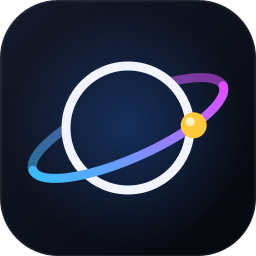
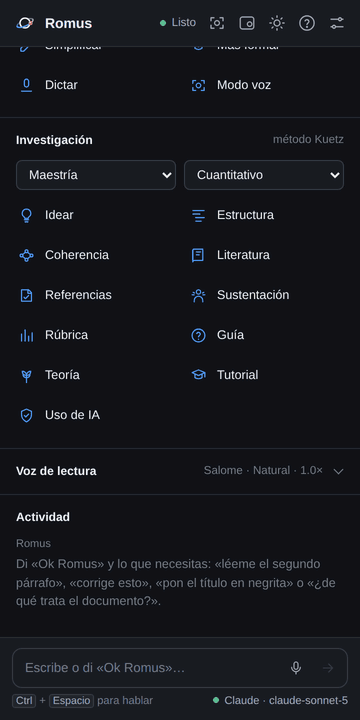
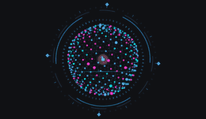
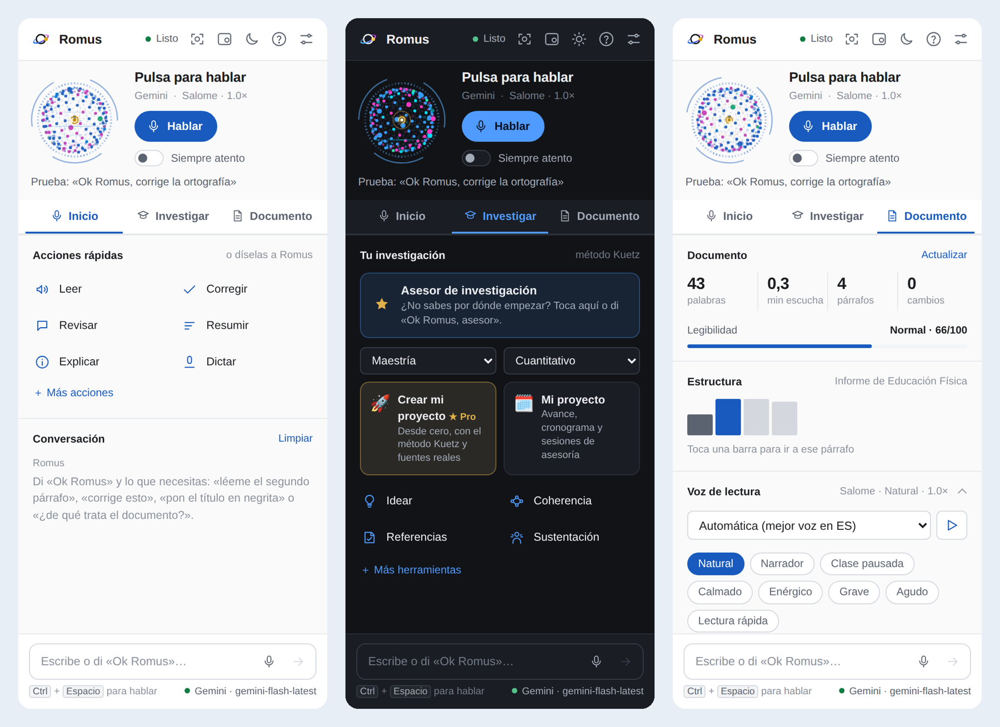
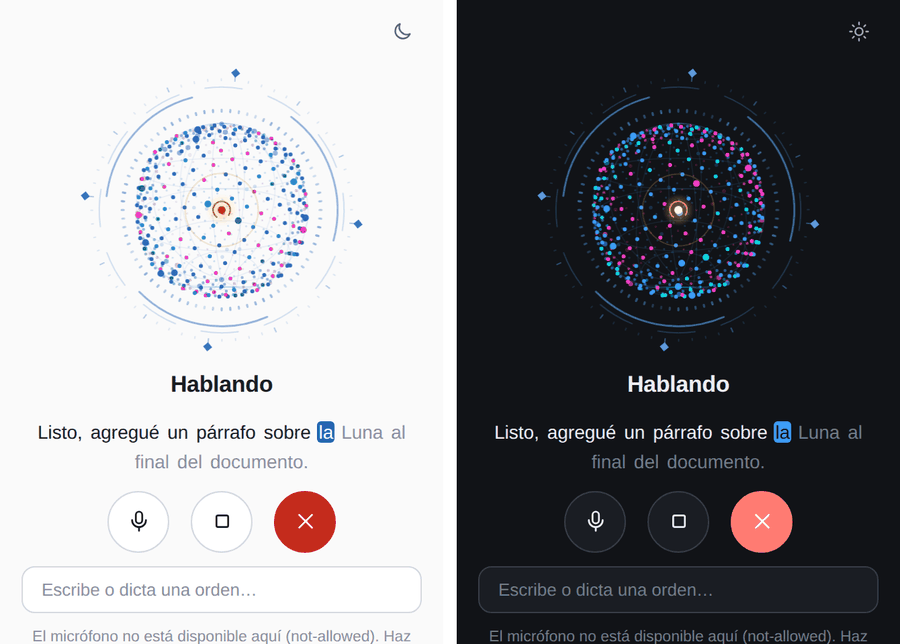
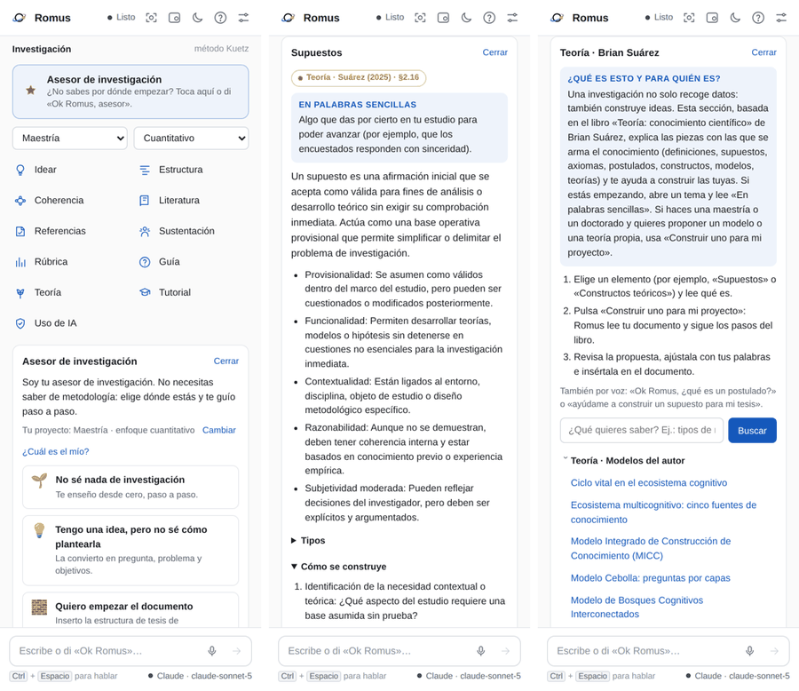
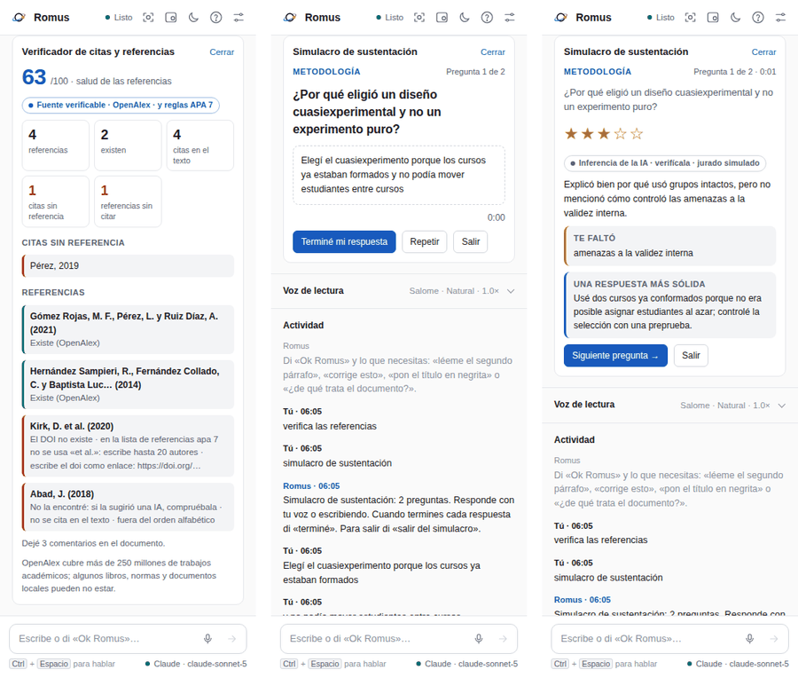
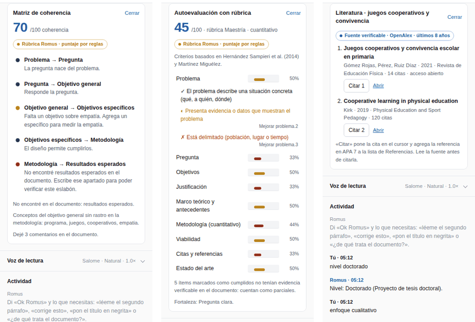

<p align="center">
  
</p>

<h1 align="center">ROMUS</h1>
<p align="center"><b>Asistente de voz con inteligencia artificial para Microsoft Word</b><br>
Di «Ok Romus» y trabaja tu documento hablando: leer, corregir, redactar, dar formato<br>y formular proyectos de investigación de pregrado a posdoctorado.</p>

<p align="center">
  <a href="https://github.com/PassBri/romus/raw/main/descargas/Instalar-Romus.exe"></a>
  <a href="https://passbri.github.io/romus/tutorial.html"></a>
  <a href="https://passbri.github.io/romus/"></a>
</p>

<p align="center">
  
  
  
  
</p>

<p align="center">
  <a href="#instalación-en-2-minutos">Instalación</a> ·
  <a href="https://passbri.github.io/romus/tutorial.html">Tutorial</a> ·
  <a href="#el-asesor-de-investigación">Asesor de investigación</a> ·
  <a href="#lo-que-hace-a-romus-insustituible">Lo insustituible</a> ·
  <a href="#comandos-de-voz">Comandos</a> ·
  <a href="#novedades">Novedades</a>
</p>

---

<table>
<tr>
<td width="44%" align="center"></td>
<td>
<b>Romus en 20 segundos</b><br><br>
1. «Ok Romus, <b>verifica las referencias</b>»: cruza citas y lista, revisa APA 7 y comprueba en OpenAlex que cada fuente exista.<br><br>
2. «Ok Romus, <b>simulacro de sustentación</b>»: hace de jurado, te pregunta en voz alta y evalúa tus respuestas.<br><br>
<br>
<sub>La esfera de Romus: escucha en magenta, habla en azul, piensa en anillos.</sub>
</td>
</tr>
</table>

## Instalación en 2 minutos

**Windows (Word de escritorio):** descarga **[Instalar-Romus.exe](https://github.com/PassBri/romus/raw/main/descargas/Instalar-Romus.exe)**, cierra Word y ábrelo. Si Windows dice «Windows protegió su PC», pulsa *Más información → Ejecutar de todas formas*: aparece porque el instalador es nuevo y no tiene firma comercial. El instalador no pide permisos de administrador. Registra Romus en Word, limpia la caché de complementos y agrega la guía y un desinstalador al menú Inicio.

**Word para la web o Mac:** descarga tu manifiesto en [passbri.github.io/romus](https://passbri.github.io/romus/) y cárgalo como explica el **[tutorial](https://passbri.github.io/romus/tutorial.html#instalar)**.

Después, en Word: **Inicio → Romus → Ajustes → + Agregar → Google Gemini** (clave gratis en [aistudio.google.com/apikey](https://aistudio.google.com/apikey)). Todo esto, con imágenes, está en el **[📘 tutorial paso a paso](https://passbri.github.io/romus/tutorial.html)**.

## ¿Qué es Romus?

Romus es un complemento (add-in) de Microsoft Word que convierte el procesador de texto en un espacio de trabajo por voz. Su identidad visual es una **esfera holográfica de partículas con un núcleo dorado**: respira en reposo, escucha con los puntos magenta, habla con los azules y se ordena en anillos cuando trabaja.

Romus nace como proyecto personal de Brian Gonzalo Suárez Acevedo, docente. Lo creó para que leer, revisar y escribir documentos sea más accesible y rápido. Desde la versión 2.3 integra el **método Kuetz**: un asesor metodológico que acompaña proyectos de investigación y tesis dentro de Word.

<p align="center"></p>

## Lo que puede hacer

| | Función | Ejemplo |
|---|---|---|
| 🔊 | **Leer en voz alta** el documento, la selección o un párrafo, marcando cada frase mientras lee. Tiene 8 estilos de voz, control de velocidad y tono. | «Ok Romus, léeme el segundo párrafo» |
| ✍️ | **Corregir** ortografía y gramática. Deja las correcciones con control de cambios para que las aceptes o rechaces una por una. | «Ok Romus, corrige el documento» |
| 💬 | **Revisar con comentarios** en el margen, sin tocar el texto. | «Ok Romus, revisa con comentarios» |
| 🧠 | **Resumir, explicar, simplificar** o volver más formal un texto. | «Ok Romus, hazlo más formal» |
| 📝 | **Redactar** párrafos, conclusiones o títulos nuevos. | «Ok Romus, escribe una conclusión al final» |
| 🎨 | **Dar formato**: negrita, cursiva, títulos, alineación, resaltado. | «Ok Romus, pon el título en negrita y centrado» |
| 🔁 | **Buscar y reemplazar** en todo el documento. | «Ok Romus, cambia alumnos por estudiantes» |
| 🎙️ | **Dictado** con puntuación hablada («coma», «punto y aparte»). | «Ok Romus, modo dictado» |
| 🫧 | **Burbuja flotante** que puedes mover sobre el documento. | «Ok Romus, abre la burbuja» |
| 🌗 | **Modo claro y oscuro**, en el panel y en la burbuja. | «Ok Romus, modo oscuro» |
| 🔬 | **Modo investigación**: idear, estructurar, revisar la coherencia, buscar literatura real y evaluar con rúbrica. | «Ok Romus, revisa la coherencia» |

<p align="center"></p>

## El asesor de investigación

**No necesitas saber metodología.** En el panel, sección **Investigación**, toca **Asesor de investigación** o di «Ok Romus, asesor» (también «no sé por dónde empezar»). Romus te pregunta dónde estás y te lleva al siguiente paso:

| Si estás aquí… | Romus te ofrece… |
|---|---|
| 🌱 No sé nada de investigación | Un tutorial desde cero, paso a paso («siguiente paso»). |
| 💡 Tengo una idea | Convertirla en pregunta, problema y objetivos. |
| 🧱 Quiero empezar el documento | La estructura de tu nivel, con una guía en cada apartado. |
| 🔎 Ya tengo un borrador | Coherencia, referencias y rúbrica, con comentarios en Word. |
| 🎓 Voy a sustentar | Un simulacro con jurado por voz. |
| 🌳 Quiero construir teoría | Axiomas, supuestos, constructos y modelos con la Teoría de Brian Suárez. |

Cada tema trae un recuadro **«En palabras sencillas»** para quien empieza.

<p align="center"></p>

## Lo que hace a Romus insustituible

Otras herramientas escriben. Romus **verifica, acompaña y prepara**, dentro de Word y por voz:

1. **Simulacro de sustentación por voz.** Romus lee tu documento y hace de jurado. Te pregunta en voz alta sobre tu metodología, tu aporte y tus limitaciones. Tú respondes hablando y él evalúa cada respuesta con criterios, te dice qué faltó, te muestra una respuesta más sólida y al final te indica qué repasar. Es un ensayo de sustentación disponible a cualquier hora.
2. **Verificador de citas y referencias.** Cruza cada cita del texto con la lista de referencias, revisa el formato APA 7 y el orden alfabético, y comprueba en OpenAlex que cada fuente exista. Detecta las referencias que inventa una IA antes de que las vea el jurado.
3. **Trust Label.** Cada resultado dice de dónde sale: de tu documento, de una fuente real, de reglas fijas, de la guía, de la Teoría o de la IA. Así sabes qué verificar.
4. **Declaración de uso de IA.** Romus registra lo que hizo y redacta la declaración que piden las universidades.

<p align="center"></p>

## Modo investigación · método Kuetz

Romus acompaña proyectos de investigación y tesis de **pregrado, especialización, maestría, doctorado y posdoctorado**, con enfoque **cuantitativo, cualitativo o mixto**. Todo ocurre dentro de Word y también se puede pedir por voz. En el panel está en la sección **Investigación**: dos selectores (nivel y enfoque) y seis botones.

<p align="center"></p>

| | Función | Di… |
|---|---|---|
| 💡 | **Idear**: lleva una idea a título, problema, tres preguntas posibles, objetivos, enfoque y riesgos. | «Ok Romus, ayúdame a idear un proyecto sobre…» |
| 🧱 | **Estructura por nivel**: inserta los apartados con títulos navegables. La metodología se ajusta al enfoque y cada apartado trae una guía en comentario. | «Ok Romus, inserta la estructura de la tesis» |
| 🔗 | **Matriz de coherencia**: revisa la cadena problema → pregunta → objetivos → metodología → resultados y detecta los conceptos del objetivo que la metodología no cubre. | «Ok Romus, revisa la coherencia» |
| 📚 | **Literatura real**: busca en OpenAlex (más de 250 millones de trabajos), cita en el cursor y agrega la referencia en APA 7 en orden alfabético. Nunca inventa fuentes. | «Ok Romus, busca literatura sobre…» y «cita el uno» |
| 📊 | **Autoevaluación con rúbrica** por nivel y enfoque. | «Ok Romus, evalúa con la rúbrica» |
| 🛡️ | **Declaración de uso de IA** con el registro de todo lo que hizo Romus en el documento. | «Ok Romus, declaración de uso de IA» |

### Guía metodológica y modo tutorial

Cuando tengas una duda de metodología, pregúntale a Romus. Responde con su **guía metodológica (método Kuetz)**: 32 temas escritos para Romus, cada uno con explicación, puntos clave, un ejemplo, el error más frecuente, la conexión con la Teoría de Brian Suárez y lecturas para profundizar.

| Quieres… | Di… |
|---|---|
| Resolver una duda | «Ok Romus, ¿qué es la saturación?», «¿cómo calculo la muestra?», «diferencia entre cuantitativo y cualitativo», «¿qué es el alfa de Cronbach?» |
| Ver todos los temas | «Ok Romus, abre la guía» (o el botón **Guía**) |
| Aprender paso a paso | «Ok Romus, modo tutorial», luego «siguiente paso», «paso anterior» o «salir del tutorial» |

- **Sin IA y sin internet**, las definiciones salen al instante de la guía local.
- **Con IA conectada**, las preguntas abiertas («¿cómo elijo a los participantes de mi estudio?») se responden apoyándose en la guía y en tu documento.
- **«Revisar mi documento con esto»** aplica el tema que estás leyendo a tu proyecto.
- **El tutorial** recorre el proceso completo según tu enfoque: 22 pasos en el cuantitativo, 20 en el cualitativo y 21 en el mixto. Cada paso trae un botón para actuar sobre tu documento.

### Teoría · biblioteca de Brian Suárez

El botón **Teoría** abre el libro *Teoría: conocimiento científico* (Suárez Acevedo, 2025), incluido en Romus con autorización del autor. Tiene dos partes:

- **Elementos del conocimiento** (32 temas del capítulo 2): axiomas, postulados, definiciones, corolarios, simulaciones, paradojas, teoremas, tesis, hipótesis, constructos, modelos, teorías, leyes, metateorías, paradigmas, supuestos, inferencias, principios, proposiciones, conceptos, problema científico, enunciados, argumentos, premisas, fenómeno, variables, operacionalización, indicadores, observación y razonamientos lógicos. Cada uno incluye su definición, características, tipos, cómo se construye, sus partes, un ejemplo y ejemplos por nivel académico.
- **Modelos del autor:** ciclo vital del ecosistema cognitivo, ecosistema multicognitivo, Modelo Integrado de Construcción de Conocimiento (MICC), modelo Cebolla, bosques cognitivos interconectados, niveles de complejidad y cognición sintética evolutiva.

**Constructor teórico.** Romus sigue los pasos y las partes que define el libro para construir el elemento a la medida de tu proyecto. Por ejemplo: «Ok Romus, ayúdame a construir un axioma para mi tesis», «formula un constructo sobre la motivación» o «crea un postulado». Luego lo insertas en el documento con un clic.

**Trust Label.** Cada resultado indica su origen:

- *Basado en tu documento*: Romus comprobó que la evidencia aparece literalmente.
- *Fuente verificable*: viene de OpenAlex.
- *Rúbrica Romus*: puntaje calculado por reglas fijas, no por la opinión de la IA.
- *Guía Romus*: viene de la guía metodológica, con el capítulo de referencia.
- *Teoría · Suárez (2025)*: viene del libro de Brian Suárez, con la sección.
- *Inferencia de la IA*: hay que verificarla.

Si la IA dice que algo se cumple pero la evidencia no aparece en el documento, el ítem cuenta solo como parcial.

### Base metodológica

Los criterios, las estructuras y las rúbricas se construyeron a partir de:

- Hernández Sampieri, R., Fernández Collado, C. y Baptista Lucio, M. P. (2014). *Metodología de la investigación* (6.ª ed.). McGraw-Hill.
- Martínez Miguélez, M. (2004). *Epistemología y metodología cualitativa en las ciencias sociales*. Trillas.
- Suárez Acevedo, B. G. (2025). *Teoría: conocimiento científico* (2.ª ed.). RouteToTop. Se incluye en Romus con autorización del autor.

Romus aplica sus conceptos con palabras propias: rutas, alcances, hipótesis y variables, diseños, muestreo, confiabilidad y validez, rigor cualitativo y posicionamiento epistemológico. La guía está escrita con palabras propias en `js/guia.js` y remite al capítulo correspondiente. Las obras no se incluyen en el repositorio porque tienen derechos de autor. Para profundizar, consulta los libros.

## Instalación rápida

1. **Publica** esta carpeta en GitHub Pages: en el repositorio ve a *Settings → Pages → Branch: main / (root)*.
2. **Descarga tu manifiesto** desde la página publicada (`https://TU-USUARIO.github.io/romus/`) con el botón *Descargar mi manifest.xml*. Sale ya configurado con tu dirección.
3. **Cárgalo en Word**:
   - **Word para la web:** *Inicio → Complementos → Más complementos → Mis complementos → Cargar mi complemento*.
   - **Word de escritorio (Windows):** usa la carpeta compartida o el registro de Windows, como explica la guía.
   - **Mac:** copia el manifiesto en `~/Library/Containers/com.microsoft.Word/Data/Documents/wef`.
4. Abre **Romus** en la pestaña *Inicio*. En **Ajustes** conecta tu IA.

La explicación detallada, con capturas y solución de problemas, está en **[GUIA-INSTALACION.md](GUIA-INSTALACION.md)**.

## Comandos de voz

Con **Siempre atento** activado, empieza cada orden con «Ok Romus». Después de responder, Romus sigue escuchando unos segundos sin que tengas que repetirlo.

| Quieres… | Di… |
|---|---|
| Que lea | «lee el documento», «lee desde aquí», «léeme la conclusión» |
| Controlar la lectura | «pausa», «sigue», «más rápido», «más lento», «para» |
| Corregir | «corrige el documento», «corrige esto», «corrige la ortografía» |
| Editar | «resume la introducción», «simplifica este párrafo», «tradúcelo al inglés» |
| Escribir | «modo dictado» (y luego «termina dictado») |
| Cambiar de IA | «usa Gemini», «usa Claude», «usa la IA local» |
| Teoría (Brian Suárez) | «abre la teoría», «¿qué es un postulado?», «¿qué es el MICC?», «ayúdame a construir un axioma para mi tesis» |
| Asesor | «Ok Romus, asesor», «no sé por dónde empezar», «ayúdame con mi tesis» |
| Sustentación | «simulacro de sustentación» (responde hablando y di «terminé»), «siguiente», «repite la pregunta», «salir del simulacro» |
| Referencias | «verifica las referencias» |
| Resolver dudas | «¿qué es…?», «¿cómo hago…?», «abre la guía», «modo tutorial», «siguiente paso» |
| Investigar | «nivel maestría», «enfoque cualitativo», «ayúdame a idear un proyecto sobre…», «inserta la estructura», «revisa la coherencia», «busca literatura sobre…», «cita el uno», «evalúa con la rúbrica», «declaración de uso de IA» |
| Ajustar cómo habla | «habla más formal», «sé breve», «a partir de ahora trátame de usted» |
| Apariencia | «modo oscuro», «modo claro», «modo voz», «abre la burbuja» |
| Terminar | «gracias, Romus» |

## Conectar una IA

Romus funciona con **cualquier IA que tenga API**. En *Ajustes → IA en uso → + Agregar* eliges el proveedor, pegas la clave y pulsas *Probar conexión y corrección*.

| Proveedor | Clave | Comentario |
|---|---|---|
| **Claude** (Anthropic) | console.anthropic.com | El que mejor escribe y corrige en español. |
| **OpenAI** (GPT) | platform.openai.com | Muy buena redacción. La API se paga aparte de ChatGPT Plus. |
| **Google Gemini** | aistudio.google.com/apikey | Tiene plan gratuito. **Además transcribe la voz en Word de escritorio.** |
| **Groq · OpenRouter · DeepSeek · Mistral** | En sus consolas | Rápidos y económicos. |
| **Ollama · LM Studio** | Sin clave | La IA corre en tu computador y los documentos no salen de él. |

> **¿Por qué hace falta una IA con audio en Word de escritorio?** El navegador interno de Word para Windows no trae reconocimiento de voz. Romus lo detecta y usa su propio oído: graba cada frase y la transcribe con Gemini, OpenAI o Groq.

### Que Romus hable mejor

- En *Ajustes → Cómo habla Romus* elige el estilo: **natural**, **profesional**, **breve** o **detallado**.
- Escribe **tus instrucciones**, por ejemplo: «Trátame de usted», «Escribe como un docente universitario» o «Cita en APA 7». Romus las sigue en cada orden.
- También puedes decirlo con la voz: «Ok Romus, a partir de ahora…».
- La calidad del lenguaje depende sobre todo del **modelo**. Para redactar al nivel de ChatGPT o Claude, usa Claude Sonnet, GPT o Gemini Pro en lugar de modelos pequeños o *lite*.

## Privacidad

- Las claves se guardan **solo en tu equipo** (almacenamiento local de Word) y viajan directamente al proveedor que elegiste. No hay servidor intermedio.
- El texto del documento se envía a la IA **solo cuando das una orden que la necesita**. La lectura en voz alta funciona sin enviar nada.
- En Word de escritorio, el audio de cada frase se envía a la IA de transcripción que conectaste. Con una IA local no sale nada de tu equipo, salvo la voz si usas el oído propio.

## Estructura del proyecto

```
romus/
├── manifest.xml          manifiesto del complemento (Word lo carga)
├── index.html            página de inicio: descarga tu manifiesto configurado
├── tutorial.html         tutorial ilustrado (passbri.github.io/romus/tutorial.html)
├── descargas/            Instalar-Romus.exe (Windows)
├── taskpane.html         panel de Romus
├── burbuja.html          burbuja flotante
├── commands.html         archivo técnico que exige Word
├── css/taskpane.css      diseño del panel (claro y oscuro)
├── js/
│   ├── app.js            lógica principal, comandos y «Ok Romus»
│   ├── voz.js            reconocimiento y lectura en voz alta, filtro de eco
│   ├── escucha.js        oído propio: graba y transcribe con la IA (Word de escritorio)
│   ├── ia.js             conexión con cualquier IA y personalidad de Romus
│   ├── documento.js      lectura y edición del documento (Word API)
│   ├── panel.js          estadísticas y estructura del documento
│   ├── investigacion.js  modo investigación: niveles, coherencia, literatura, rúbrica, Trust Label, tutorial
│   ├── jurado.js         simulacro de sustentación y verificador de citas y referencias
│   ├── guia.js           guía metodológica: 32 temas, buscador y rutas del tutorial
│   ├── teoria.js         biblioteca «Teoría: conocimiento científico» (Suárez, 2025): 39 temas
│   ├── romus.js          la esfera holográfica de Romus
│   ├── orbe.js           medidor del micrófono
│   └── config.js         ajustes guardados en tu equipo
├── assets/               logo, íconos, capturas y GIF
├── GUIA-INSTALACION.md   instalación paso a paso
└── LEEME.md              notas técnicas ampliadas
```

Todo es HTML, CSS y JavaScript puro: no hace falta compilar nada. Para publicar una versión nueva basta con subir los archivos a GitHub. Después cierra Word y vacía la caché de complementos (`%LOCALAPPDATA%\Microsoft\Office\16.0\Wef\`).

## Tecnologías

Office.js (Word API 1.3+, Dialog API) · Web Speech API · Web Audio API · Canvas 2D · APIs de Anthropic, OpenAI y Gemini, más cualquier API compatible con OpenAI · GitHub Pages.

## Novedades

### v2.6 · Asesor, sustentación y verificador
- **Asesor de investigación**: guía según dónde estés, pensado para quien no sabe nada de investigación.
- **Simulacro de sustentación por voz** con jurado, evaluación por criterios y resultado final.
- **Verificador de citas y referencias**: cruce cita↔referencia, formato APA 7 y existencia real en OpenAlex.
- «En palabras sencillas» en cada elemento de la Teoría.
- **Instalador para Windows** (`descargas/Instalar-Romus.exe`) y **[tutorial ilustrado](https://passbri.github.io/romus/tutorial.html)**.

### v2.5 · Teoría de Brian Suárez
- Nueva biblioteca **Teoría** con 32 elementos del conocimiento y 7 modelos del autor (MICC, Cebolla, bosques cognitivos…).
- **Constructor teórico**: axiomas, postulados, constructos, modelos y más, construidos para tu proyecto según los pasos del libro.
- Las dudas por voz buscan a la vez en la guía metodológica y en la Teoría.

### v2.4 · Guía metodológica y modo tutorial
- **Guía** con 32 temas en 7 categorías, redactada a partir de Hernández Sampieri et al. (2014) y Martínez Miguélez (2004), con capítulo de referencia.
- Dudas por voz («¿qué es…?», «¿cómo hago…?»): respuesta inmediata sin IA; con IA, respuesta apoyada en la guía y en tu documento.
- **Modo tutorial** paso a paso según el enfoque, con progreso guardado.
- «Revisar mi documento con esto» aplica cualquier tema a tu proyecto.

### v2.3 · Modo investigación (método Kuetz)
- Nueva sección **Investigación** con nivel (pregrado → posdoctorado) y enfoque (cuantitativo, cualitativo, mixto).
- **Idear**, **estructura por nivel** con guías en comentarios, **matriz de coherencia**, **literatura real** de OpenAlex con citas y referencias en APA 7, **rúbrica** con puntaje por reglas y **declaración de uso de IA**.
- **Trust Label** en cada resultado y verificación de evidencias contra el documento.
- Base metodológica: Hernández Sampieri et al. (2014) y Martínez Miguélez (2004).
- La IA general ya no inventa referencias: cuando le piden fuentes, usa la búsqueda real.

### v2.2 · Voz en Word de escritorio
- **Oído propio**: en Word para Windows, Romus graba cada frase y la transcribe con Gemini, OpenAI o Groq (el navegador interno no trae reconocimiento de voz).
- **Filtro de eco**: Romus ya no se oye a sí mismo por los parlantes ni repite órdenes.
- Respuestas más rápidas con Gemini (sin «pensar» al transcribir ni en órdenes cortas).
- **Modo claro y oscuro** con botón de luna o sol, en Ajustes o por voz.
- **Cómo habla Romus**: estilo (natural, profesional, breve, detallado) e instrucciones personales; personalidad reescrita para un español más natural.
- **Burbuja** rediseñada con el mismo estilo del modo voz y su propio botón de tema.
- Se retiró la apariencia «cielo»: Romus tiene una sola identidad, la esfera.

### v2.1 · Romus
- Nombre e identidad Romus, activación con «Ok Romus», logo «Planeta», diseño limpio acorde a Word.
- Conexión con cualquier IA por API, perfiles múltiples y modo básico para modelos sin herramientas.

## Autor

**Brian Gonzalo Suárez Acevedo**: docente y creador del proyecto Romus.
GitHub: [@PassBri](https://github.com/PassBri)

---

<p align="center"><sub>Romus para Word · v2.6</sub></p>
