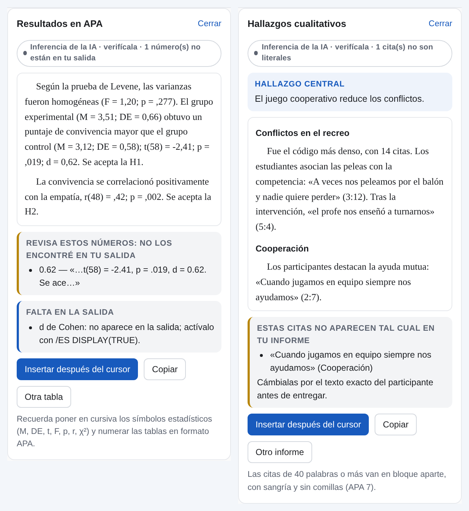
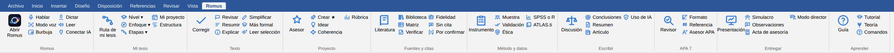
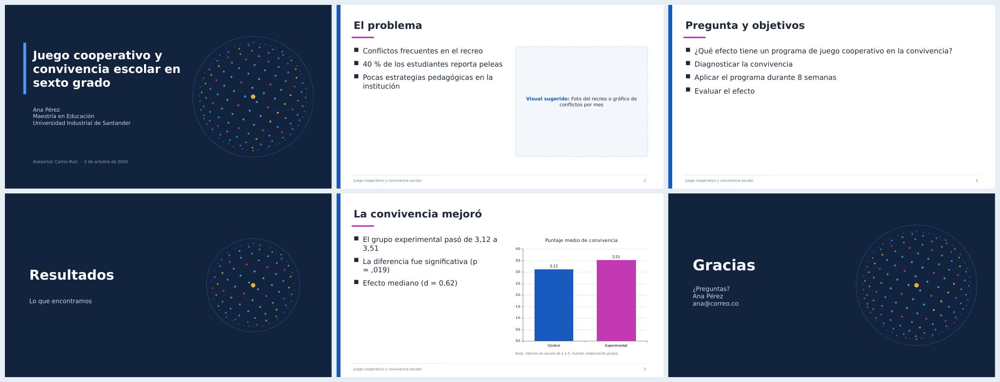
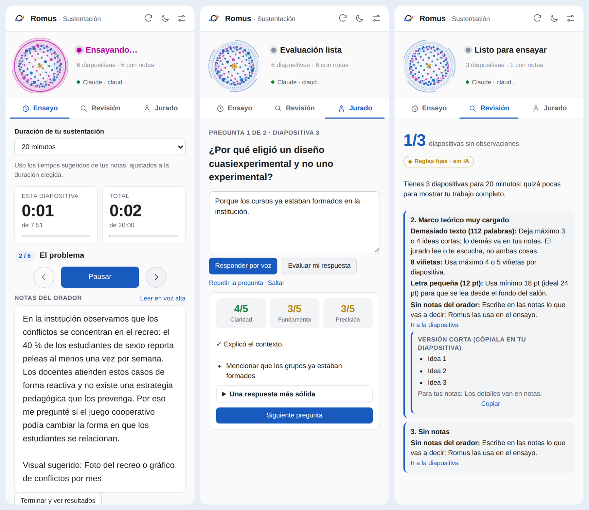
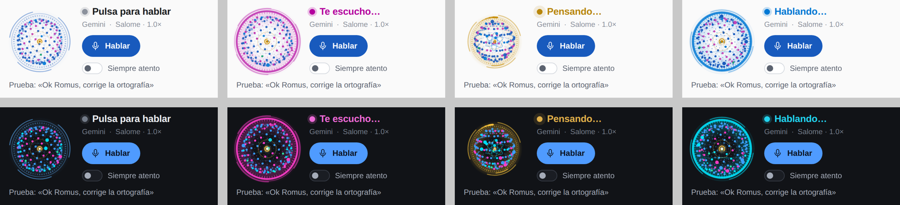

<p align="center">
  
</p>

<h1 align="center">ROMUS</h1>
<p align="center"><b>Asistente de voz con inteligencia artificial para Microsoft Word</b><br>
Di «Ok Romus» y trabaja tu documento hablando: leer, corregir, redactar, dar formato<br>y formular proyectos de investigación de pregrado a posdoctorado.</p>

<p align="center">
  <a href="https://github.com/PassBri/romus/raw/main/descargas/Instalar-Romus.exe"></a>
  <a href="https://passbri.github.io/romus/tutorial.html"></a>
  <a href="https://passbri.github.io/romus/"></a>
</p>

<p align="center">
  
  
  
  
</p>

<p align="center">
  <a href="#instalación-en-2-minutos">Instalación</a> ·
  <a href="https://passbri.github.io/romus/tutorial.html">Tutorial</a> ·
  <a href="#el-asesor-de-investigación">Asesor de investigación</a> ·
  <a href="#-romus-pro--crear-un-proyecto-desde-cero">Romus Pro</a> ·
  <a href="#lo-que-hace-a-romus-insustituible">Lo insustituible</a> ·
  <a href="#comandos-de-voz">Comandos</a> ·
  <a href="#novedades">Novedades</a>
</p>

---

<table>
<tr>
<td width="44%" align="center"></td>
<td>
<b>Romus en 20 segundos</b><br><br>
1. «Ok Romus, <b>verifica las referencias</b>»: cruza citas y lista, revisa APA 7 y comprueba en OpenAlex que cada fuente exista.<br><br>
2. «Ok Romus, <b>simulacro de sustentación</b>»: hace de jurado, te pregunta en voz alta y evalúa tus respuestas.<br><br>
<br>
<sub>La esfera de Romus: escucha en magenta, habla en azul, piensa en anillos.</sub>
</td>
</tr>
</table>

## Instalación en 2 minutos

**Windows (Word de escritorio):** descarga **[Instalar-Romus.exe](https://github.com/PassBri/romus/raw/main/descargas/Instalar-Romus.exe)**, cierra Word y ábrelo. Si Windows dice «Windows protegió su PC», pulsa *Más información → Ejecutar de todas formas*: aparece porque el instalador es nuevo y no tiene firma comercial. El instalador no pide permisos de administrador. Registra Romus en Word **de forma permanente** (aparece cada vez que abres Word) y agrega al menú Inicio la guía, **Reparar Romus** y el desinstalador. No cargues el manifiesto a mano con «Cargar mi complemento» en Word de escritorio: Word puede olvidarlo al cerrarse.

**Word para la web o Mac:** descarga tu manifiesto en [passbri.github.io/romus](https://passbri.github.io/romus/) y cárgalo como explica el **[tutorial](https://passbri.github.io/romus/tutorial.html#instalar)**.

Después, en Word: **pestaña Romus → Abrir Romus → Ajustes → + Agregar → Google Gemini** (clave gratis en [aistudio.google.com/apikey](https://aistudio.google.com/apikey)). Todo esto, con imágenes, está en el **[📘 tutorial paso a paso](https://passbri.github.io/romus/tutorial.html)**.

## ¿Qué es Romus?

Romus es un complemento (add-in) de Microsoft Word que convierte el procesador de texto en un espacio de trabajo por voz. Su identidad visual es una **esfera holográfica de partículas con un núcleo dorado**: respira en reposo, escucha con los puntos magenta, habla con los azules y se ordena en anillos cuando trabaja.

Romus nace como proyecto personal de Brian Gonzalo Suárez Acevedo, docente. Lo creó para que leer, revisar y escribir documentos sea más accesible y rápido. Desde la versión 2.3 integra el **método Kuetz**: un asesor metodológico que acompaña proyectos de investigación y tesis dentro de Word.

<p align="center"></p>

## Lo que puede hacer

| | Función | Ejemplo |
|---|---|---|
| 🔊 | **Leer en voz alta** el documento, la selección o un párrafo, marcando cada frase mientras lee. Tiene 8 estilos de voz, control de velocidad y tono. | «Ok Romus, léeme el segundo párrafo» |
| ✍️ | **Corregir** ortografía y gramática. Deja las correcciones con control de cambios para que las aceptes o rechaces una por una. | «Ok Romus, corrige el documento» |
| 💬 | **Revisar con comentarios** en el margen, sin tocar el texto. | «Ok Romus, revisa con comentarios» |
| 🧠 | **Resumir, explicar, simplificar** o volver más formal un texto. | «Ok Romus, hazlo más formal» |
| 📝 | **Redactar** párrafos, conclusiones o títulos nuevos. | «Ok Romus, escribe una conclusión al final» |
| 🎨 | **Dar formato**: negrita, cursiva, títulos, alineación, resaltado. | «Ok Romus, pon el título en negrita y centrado» |
| 🔁 | **Buscar y reemplazar** en todo el documento. | «Ok Romus, cambia alumnos por estudiantes» |
| 🎙️ | **Dictado** con puntuación hablada («coma», «punto y aparte»). | «Ok Romus, modo dictado» |
| 🫧 | **Burbuja flotante** que puedes mover sobre el documento. | «Ok Romus, abre la burbuja» |
| 🌗 | **Modo claro y oscuro**, en el panel y en la burbuja. | «Ok Romus, modo oscuro» |
| 🔬 | **Modo investigación**: idear, estructurar, revisar la coherencia, buscar literatura real y evaluar con rúbrica. | «Ok Romus, revisa la coherencia» |

<p align="center"></p>

## El asesor de investigación

**No necesitas saber metodología.** Romus trabaja como un asesor de tesis real y cumple sus cinco funciones:

| Función de un asesor | Cómo la cumple Romus |
|---|---|
| **Gestionar el proyecto** | **Mi proyecto**: etapas, porcentaje de avance calculado con tus títulos, lo que sigue y un **cronograma** hacia tu fecha de entrega, que puedes insertar en Word. |
| **Revisar y retroalimentar** | **Sesión de asesoría**: lee tu avance, reconoce lo que hiciste bien y da un diagnóstico, 3 prioridades con el cómo, preguntas para pensar y tareas con plazo. Queda en la **bitácora** y en la siguiente sesión revisa si las cumpliste. |
| **Enseñar el oficio** | Guía metodológica, tutorial paso a paso y la Teoría de Brian Suárez, con explicaciones «en palabras sencillas». |
| **Formar pensamiento crítico** | Matriz de coherencia, rúbrica por nivel y preguntas socráticas sobre tu propio trabajo. |
| **Dar autonomía** | **Modo Tutor**, activado por defecto: Romus te guía y te pregunta en lugar de redactar por ti. Si prefieres que proponga textos, en *Ajustes → Asesor de investigación* elige **Coautor**. |

**Para empezar**, abre la pestaña **Investigar** y toca **Asesor de investigación** o di «Ok Romus, asesor» (también vale «no sé por dónde empezar»). Romus te pregunta dónde estás y te lleva al paso siguiente: no sé nada · tengo una idea · quiero empezar el documento · tengo un borrador · voy a sustentar · quiero construir teoría.

<p align="center"></p>

## ★ Romus Pro · crear un proyecto desde cero

Con **Crear mi proyecto**, Romus construye contigo un proyecto completo siguiendo el **método Kuetz, en 7 fases**:

1. **Descubrir.** Una entrevista corta: tu idea, con quiénes y dónde, el problema que observaste y tus recursos.
2. **Delimitar.** Título, problema, pregunta, objetivos, justificación e hipótesis. **Tú apruebas** o pides ajustes («hazlo cualitativo»).
3. **Fundamentar.** Busca **fuentes reales** en OpenAlex y redacta antecedentes y marco teórico citando solo esas fuentes, en APA 7.
4. **Diseñar.** La metodología completa según tu nivel y enfoque.
5. **Planear.** Cronograma, presupuesto en pesos colombianos y resultados esperados.
6. **Verificar.** Revisa la coherencia y deja comentarios donde haya que ajustar.
7. **Declarar.** Agrega la declaración de uso de IA.

Romus **no inventa datos ni resultados**: donde falta información real escribe *[dato por confirmar]*. El resultado es un anteproyecto que tú lees, completas y haces tuyo. Cada instalación trae **1 proyecto de prueba gratis**; con un código **Romus Pro** (*Ajustes → Romus Pro*) los proyectos son ilimitados.

## Analizar tus datos · SPSS y ATLAS.ti

Donde más se atascan los tesistas es entre los datos y el capítulo de resultados. Romus hace de puente en los dos sentidos:

| | Cuantitativo · SPSS o PSPP | Cualitativo · ATLAS.ti |
|---|---|---|
| **Antes de analizar** | **Sintaxis de SPSS** (.sps) generada desde tu operacionalización e hipótesis: etiquetas de variables y valores, datos perdidos, nivel de medición, puntajes de escalas, alfa de Cronbach, normalidad y **una prueba por hipótesis** (t, ANOVA, correlación, chi cuadrado, regresión…) con su alternativa no paramétrica. También inserta el **plan de análisis** redactado y una **plantilla de datos** en Excel. | **Libro de códigos** desde tus categorías y objetivos, en **Excel con el formato de importación de ATLAS.ti** («Categoría: código», comentario y grupo) y en **QDC** (REFI-QDA), que también abren NVivo y MAXQDA. |
| **Después de analizar** | Pega las tablas de la salida y Romus **redacta los resultados en APA 7**: *t*(58) = 2,41; *p* = ,019. **Comprueba que cada número exista en tu salida** y te marca los que no. | Pega el informe de códigos y citas, y Romus **redacta los hallazgos por categoría**, comprobando que **cada cita sea literal**. |

Toca **SPSS** o **ATLAS.ti** en *Investigar → Más herramientas*, o di «Ok Romus, genera la sintaxis de SPSS», «redacta los resultados en APA» o «libro de códigos para ATLAS.ti». ¿No tienes SPSS? La sintaxis funciona igual en **PSPP**, que es gratuito. Puedes elegir decimales con coma o con punto. Romus no sube tus bases de datos: trabaja con tu documento y con lo que pegas.

<p align="center"></p>

## La pestaña «Romus» en Word

Desde la versión 3.0, Romus tiene **su propia pestaña en la cinta de opciones de Word**. Cada botón hace su trabajo directamente: el panel lateral se abre solo cuando hay un resultado que mostrar, y con **Burbuja** puedes trabajar sin panel.

<p align="center"></p>

| Grupo | Botones |
|---|---|
| **Romus** | Abrir Romus · Hablar · Modo voz · Burbuja |
| **Documento** | Leer · Corregir · Revisar · Resumir · Más (Explicar, Leer selección, Simplificar, Más formal, Dictar) |
| **Investigación** | Asesor · Mi proyecto · Crear proyecto ★ · Planear y fundamentar ▾ · Diseñar y analizar ▾ · Escribir y entregar ▾ |
| **APA 7** | Asesor APA · Revisor · Formato · Referencia |
| **Ayuda** | Aprender ▾ (Guía, Teoría, Tutorial, Qué puedo decir) · Modo director |
| **PowerPoint · Sustentación** | Abrir Romus · Ensayo · Revisar diapositivas · Simulacro de jurado |

Los botones que actúan directamente funcionan en Microsoft 365 (Word 2205 o posterior), Word 2024, Word para la web y Word para Mac 16.61 o posterior. En versiones anteriores, el botón deja la acción lista y se ejecuta al abrir el panel. Si ya tenías Romus, **vuelve a ejecutar el instalador** para ver la pestaña nueva. Con el panel cerrado, Romus deja de escuchar, salvo que la burbuja esté abierta.

## Normas APA 7

| Herramienta | Qué hace |
|---|---|
| **Asesor APA 7** | Responde dudas («¿cómo cito una ley?», «¿cómo cito a ChatGPT?», «¿qué pasa con tres autores?») con 19 temas escritos para Romus. |
| **Generador de referencias** | Artículo, libro, capítulo, tesis, página web, informe, ley colombiana, video, ponencia, periódico o IA: llenas los datos y obtienes la referencia y la cita (parentética y narrativa). La inserta en orden alfabético, con sangría francesa y cursivas. |
| **Revisor APA 7** | Revisa todo el documento con reglas fijas: citas («&», «et al.», tres o más autores, coma, página en citas textuales, citas de 40 palabras), referencias (DOI, «Recuperado de», «Vol.», mayúsculas, orden alfabético), cruce citas ↔ referencias, títulos, tablas y figuras («Nota.» en vez de «Fuente:»), estadísticos (p = .000), siglas sin definir y lenguaje sin sesgos. **Corrige lo seguro en un clic** y deja comentarios para lo demás. |
| **Corregir referencias con IA** | Propone la versión APA 7 de cada referencia y Romus **comprueba que no cambie autores, años ni agregue datos inventados** antes de dejarte aplicarla. |
| **Formato APA 7 en un clic** | Fuente, interlineado doble, sangría de 1,27 cm, los 5 niveles de título, referencias con sangría francesa, rótulos de tablas y figuras, notas, portada de estudiante, número de página y tabla de contenido. |

## Del proyecto al trabajo de campo

- **Tamaño de muestra**: poblaciones finitas e infinitas, comparación de dos grupos y correlación (con potencia), pérdida esperada y orientación para estudios cualitativos. Te deja el párrafo para la metodología.
- **Instrumentos**: cuestionario Likert desde la operacionalización (ítems numerados p1, p2… que coinciden con la sintaxis de SPSS) o guion de entrevista desde las categorías, más la matriz de operacionalización o de categorías.
- **Validación por jueces**: formato para los expertos en Word, **V de Aiken** con intervalo de confianza (Penfield y Giacobbi, 2004) y **razón de Lawshe** con el valor crítico exacto (Ayre y Scally, 2014). Tabla y párrafo listos.
- **Ética**: consentimiento informado, consentimiento de acudientes y **asentimiento para menores** en lenguaje sencillo, carta a la institución y autorización de tratamiento de datos (Ley 1581 de 2012), con la clasificación del riesgo de la Resolución 8430 de 1993.

## Literatura y escritura

- **Mi biblioteca**: guarda fuentes de OpenAlex (también **solo en español**), del generador APA o importadas de **Zotero y Mendeley** (RIS o BibTeX).
- **Fichas de lectura** de cada fuente (objetivo, contexto, método, hallazgos, limitaciones, aporte) y **matriz de antecedentes** en Word.
- **Estado del arte** organizado por temas, citando solo las fuentes de tu biblioteca.
- **Frases sin cita**: lo que el jurado preguntaría «¿según quién?», y **cita–fuente**: ¿la fuente dice lo que le atribuyes?
- **Discusión triangulada**: cada resultado frente a los antecedentes que ya citas.
- **Conclusiones frente a objetivos**: qué objetivo quedó sin conclusión y qué conclusión no responde a ningún objetivo.
- **Resumen y abstract** con palabras clave, **tesis → artículo** (IMRyD) con las revistas que más publican tu tema, y **diapositivas de sustentación** (esquema que PowerPoint convierte en presentación, más el guion del orador).

## Revisión y acompañamiento

- **Respuesta a observaciones**: Romus lee los comentarios del jurado o del asesor en tu documento, revisa si ya los atendiste y arma la **matriz de respuesta**. Puede responder dentro de cada comentario y marcar como resueltos los atendidos.
- **Acta de asesoría** en Word, con temas, avances, compromisos con fecha y firmas, a partir de las sesiones de Romus.
- **Modo director**: el docente abre el trabajo de un estudiante y obtiene un **informe de revisión** (rúbrica, APA 7, avance, fortalezas, aspectos por mejorar y concepto) y el seguimiento de todos sus estudiantes.
- **Script de R y jamovi**, además de la sintaxis de SPSS.

## Sustentación en PowerPoint

El contenido y las preguntas del jurado salen de tu documento; el ensayo ocurre en PowerPoint. Romus acompaña las dos partes.

**1. Desde Word: tu presentación real (.pptx).** Pestaña Romus → *Escribir y entregar → Presentación* (o «haz las diapositivas de la sustentación»). Romus arma la presentación con diseño propio, **notas del orador con el tiempo sugerido para cada diapositiva** y **gráficos nativos de PowerPoint solo cuando sus datos aparecen en tu documento**; si un número no está en tu tesis, el gráfico se descarta y queda una sugerencia de visual.

<p align="center"></p>

**2. En PowerPoint: Romus · Sustentación.** El mismo complemento aparece en PowerPoint con su pestaña **Romus**:

| Botón | Qué hace |
|---|---|
| **Ensayo** | Cronómetro por diapositiva y total, con el tiempo de cada una tomado de tus notas. Avanza con las flechas o con PowerPoint (el ensayo te sigue). Lee tus notas en voz alta si quieres. Al terminar: tiempo planeado frente a real por diapositiva, dónde te extendiste y comparación con el ensayo anterior. |
| **Revisar diapositivas** | Con reglas fijas, sin IA: demasiado texto, demasiadas viñetas, frases largas, letra menor de 18 pt, diapositivas sin notas, varias seguidas solo con texto y número de diapositivas para tu tiempo. Si conectaste una IA, propone una versión corta para copiar. |
| **Simulacro de jurado** | Preguntas de jurado sobre tus diapositivas y notas, en voz alta. Respondes hablando (o escribiendo) y recibes nota en claridad, fundamento y precisión, lo que faltó y una respuesta más sólida. Al final, qué repasar. |

<p align="center"></p>

Romus lee la presentación completa (texto, letra, imágenes y notas) con la API común de Office, así que el ensayo y la revisión funcionan en PowerPoint de escritorio, en la web y en Mac. La voz del simulacro usa la IA que conectaste (Gemini sirve).

## Lo que hace a Romus insustituible

Otras herramientas escriben. Romus **verifica, acompaña y prepara**, dentro de Word y por voz:

1. **Simulacro de sustentación por voz.** Romus lee tu documento y hace de jurado. Te pregunta en voz alta sobre tu metodología, tu aporte y tus limitaciones. Tú respondes hablando y él evalúa cada respuesta con criterios, te dice qué faltó, te muestra una respuesta más sólida y al final te indica qué repasar. Es un ensayo de sustentación disponible a cualquier hora.
2. **Verificador de citas y referencias.** Cruza cada cita del texto con la lista de referencias, revisa el formato APA 7 y el orden alfabético, y comprueba en OpenAlex que cada fuente exista. Detecta las referencias que inventa una IA antes de que las vea el jurado.
3. **Trust Label.** Cada resultado dice de dónde sale: de tu documento, de una fuente real, de reglas fijas, de la guía, de la Teoría o de la IA. Así sabes qué verificar.
4. **Resultados que no inventan datos.** Del SPSS o el ATLAS.ti al capítulo de resultados en APA, con cada número y cada cita comprobados contra tu salida.
5. **Declaración de uso de IA.** Romus registra lo que hizo y redacta la declaración que piden las universidades.

<p align="center"></p>

## Modo investigación · método Kuetz

Romus acompaña proyectos de investigación y tesis de **pregrado, especialización, maestría, doctorado y posdoctorado**, con enfoque **cuantitativo, cualitativo o mixto**. Todo ocurre dentro de Word y también se puede pedir por voz. En el panel está en la sección **Investigación**: dos selectores (nivel y enfoque) y seis botones.

<p align="center"></p>

| | Función | Di… |
|---|---|---|
| 💡 | **Idear**: lleva una idea a título, problema, tres preguntas posibles, objetivos, enfoque y riesgos. | «Ok Romus, ayúdame a idear un proyecto sobre…» |
| 🧱 | **Estructura por nivel**: inserta los apartados con títulos navegables. La metodología se ajusta al enfoque y cada apartado trae una guía en comentario. | «Ok Romus, inserta la estructura de la tesis» |
| 🔗 | **Matriz de coherencia**: revisa la cadena problema → pregunta → objetivos → metodología → resultados y detecta los conceptos del objetivo que la metodología no cubre. | «Ok Romus, revisa la coherencia» |
| 📚 | **Literatura real**: busca en OpenAlex (más de 250 millones de trabajos), cita en el cursor y agrega la referencia en APA 7 en orden alfabético. Nunca inventa fuentes. | «Ok Romus, busca literatura sobre…» y «cita el uno» |
| 📊 | **Autoevaluación con rúbrica** por nivel y enfoque. | «Ok Romus, evalúa con la rúbrica» |
| 🛡️ | **Declaración de uso de IA** con el registro de todo lo que hizo Romus en el documento. | «Ok Romus, declaración de uso de IA» |

### Guía metodológica y modo tutorial

Cuando tengas una duda de metodología, pregúntale a Romus. Responde con su **guía metodológica (método Kuetz)**: 32 temas escritos para Romus, cada uno con explicación, puntos clave, un ejemplo, el error más frecuente, y la conexión con la Teoría de Brian Suárez.

| Quieres… | Di… |
|---|---|
| Resolver una duda | «Ok Romus, ¿qué es la saturación?», «¿cómo calculo la muestra?», «diferencia entre cuantitativo y cualitativo», «¿qué es el alfa de Cronbach?» |
| Ver todos los temas | «Ok Romus, abre la guía» (o el botón **Guía**) |
| Aprender paso a paso | «Ok Romus, modo tutorial», luego «siguiente paso», «paso anterior» o «salir del tutorial» |

- **Sin IA y sin internet**, las definiciones salen al instante de la guía local.
- **Con IA conectada**, las preguntas abiertas («¿cómo elijo a los participantes de mi estudio?») se responden apoyándose en la guía y en tu documento.
- **«Revisar mi documento con esto»** aplica el tema que estás leyendo a tu proyecto.
- **El tutorial** recorre el proceso completo según tu enfoque: 22 pasos en el cuantitativo, 20 en el cualitativo y 21 en el mixto. Cada paso trae un botón para actuar sobre tu documento.

### Teoría · biblioteca de Brian Suárez

El botón **Teoría** abre el libro *Teoría: conocimiento científico* (Suárez Acevedo, 2025), incluido en Romus con autorización del autor. Tiene dos partes:

- **Elementos del conocimiento** (32 temas del capítulo 2): axiomas, postulados, definiciones, corolarios, simulaciones, paradojas, teoremas, tesis, hipótesis, constructos, modelos, teorías, leyes, metateorías, paradigmas, supuestos, inferencias, principios, proposiciones, conceptos, problema científico, enunciados, argumentos, premisas, fenómeno, variables, operacionalización, indicadores, observación y razonamientos lógicos. Cada uno incluye su definición, características, tipos, cómo se construye, sus partes, un ejemplo y ejemplos por nivel académico.
- **Modelos del autor:** ciclo vital del ecosistema cognitivo, ecosistema multicognitivo, Modelo Integrado de Construcción de Conocimiento (MICC), modelo Cebolla, bosques cognitivos interconectados, niveles de complejidad y cognición sintética evolutiva.

**Constructor teórico.** Romus sigue los pasos y las partes que define el libro para construir el elemento a la medida de tu proyecto. Por ejemplo: «Ok Romus, ayúdame a construir un axioma para mi tesis», «formula un constructo sobre la motivación» o «crea un postulado». Luego lo insertas en el documento con un clic.

**Trust Label.** Cada resultado indica su origen:

- *Basado en tu documento*: Romus comprobó que la evidencia aparece literalmente.
- *Fuente verificable*: viene de OpenAlex.
- *Rúbrica Romus*: puntaje calculado por reglas fijas, no por la opinión de la IA.
- *Guía Romus · método Kuetz*: viene de la guía metodológica de Romus.
- *Teoría · Suárez (2025)*: viene del libro de Brian Suárez, con la sección.
- *Inferencia de la IA*: hay que verificarla.

Si la IA dice que algo se cumple pero la evidencia no aparece en el documento, el ítem cuenta solo como parcial.

## Instalación rápida

1. **Publica** esta carpeta en GitHub Pages: en el repositorio ve a *Settings → Pages → Branch: main / (root)*.
2. **Descarga tu manifiesto** desde la página publicada (`https://TU-USUARIO.github.io/romus/`) con el botón *Descargar mi manifest.xml*. Sale ya configurado con tu dirección.
3. **Cárgalo en Word**:
   - **Word para la web:** *Inicio → Complementos → Más complementos → Mis complementos → Cargar mi complemento*.
   - **Word de escritorio (Windows):** usa la carpeta compartida o el registro de Windows, como explica la guía.
   - **Mac:** copia el manifiesto en `~/Library/Containers/com.microsoft.Word/Data/Documents/wef`.
4. Abre **Romus** en la pestaña *Inicio*. En **Ajustes** conecta tu IA.

La explicación detallada, con capturas y solución de problemas, está en **[GUIA-INSTALACION.md](GUIA-INSTALACION.md)**.

## Comandos de voz

Con **Siempre atento** activado, empieza cada orden con «Ok Romus». Después de responder, Romus sigue escuchando unos segundos sin que tengas que repetirlo.

| Quieres… | Di… |
|---|---|
| Que lea | «lee el documento», «lee desde aquí», «léeme la conclusión» |
| Normas APA 7 | «asesor APA», «revisa mi documento con normas APA», «aplica el formato APA», «genera una referencia de libro», «corrige las referencias con IA» |
| Trabajo de campo | «calcula el tamaño de la muestra», «diseña el cuestionario», «hazme el guion de entrevista», «calcula la V de Aiken», «prepara los consentimientos» |
| Literatura | «abre mi biblioteca», «busca literatura en español sobre…», «matriz de antecedentes», «busca afirmaciones sin cita» |
| Escribir y entregar | «ayúdame con la discusión», «revisa las conclusiones frente a los objetivos», «hazme el resumen y abstract», «convierte mi tesis en artículo», «haz las diapositivas de la sustentación», «responde a las observaciones del jurado», «acta de asesoría», «modo director» |
| Cambiar de pestaña | «ve a investigar», «abre documento», «ve a inicio» |
| Analizar datos | «genera la sintaxis de SPSS», «redacta los resultados en APA», «libro de códigos para ATLAS.ti», «redacta los resultados cualitativos» |
| Controlar la lectura | «pausa», «sigue», «más rápido», «más lento», «para» |
| Corregir | «corrige el documento», «corrige esto», «corrige la ortografía» |
| Editar | «resume la introducción», «simplifica este párrafo», «tradúcelo al inglés» |
| Escribir | «modo dictado» (y luego «termina dictado») |
| Cambiar de IA | «usa Gemini», «usa Claude», «usa la IA local» |
| Teoría (Brian Suárez) | «abre la teoría», «¿qué es un postulado?», «¿qué es el MICC?», «ayúdame a construir un axioma para mi tesis» |
| Asesor | «Ok Romus, asesor», «no sé por dónde empezar», «mi proyecto», «sesión de asesoría», «bitácora» |
| Pro | «crea mi proyecto sobre…» |
| Sustentación | «simulacro de sustentación» (responde hablando y di «terminé»), «siguiente», «repite la pregunta», «salir del simulacro» |
| Referencias | «verifica las referencias» |
| Resolver dudas | «¿qué es…?», «¿cómo hago…?», «abre la guía», «modo tutorial», «siguiente paso» |
| Investigar | «nivel maestría», «enfoque cualitativo», «ayúdame a idear un proyecto sobre…», «inserta la estructura», «revisa la coherencia», «busca literatura sobre…», «cita el uno», «evalúa con la rúbrica», «declaración de uso de IA» |
| Ajustar cómo habla | «habla más formal», «sé breve», «a partir de ahora trátame de usted» |
| Apariencia | «modo oscuro», «modo claro», «modo voz», «abre la burbuja» |
| Terminar | «gracias, Romus» |

## Conectar una IA

Romus funciona con **cualquier IA que tenga API**. En *Ajustes → IA en uso → + Agregar* eliges el proveedor, pegas la clave y pulsas *Probar conexión y corrección*.

| Proveedor | Clave | Comentario |
|---|---|---|
| **Claude** (Anthropic) | console.anthropic.com | El que mejor escribe y corrige en español. |
| **OpenAI** (GPT) | platform.openai.com | Muy buena redacción. La API se paga aparte de ChatGPT Plus. |
| **Google Gemini** | aistudio.google.com/apikey | Tiene plan gratuito. **Además transcribe la voz en Word de escritorio.** |
| **Groq · OpenRouter · DeepSeek · Mistral** | En sus consolas | Rápidos y económicos. |
| **Ollama · LM Studio** | Sin clave | La IA corre en tu computador y los documentos no salen de él. |

> **¿Por qué hace falta una IA con audio en Word de escritorio?** El navegador interno de Word para Windows no trae reconocimiento de voz. Romus lo detecta y usa su propio oído: graba cada frase y la transcribe con Gemini, OpenAI o Groq.

### Que Romus hable mejor

- En *Ajustes → Cómo habla Romus* elige el estilo: **natural**, **profesional**, **breve** o **detallado**.
- Escribe **tus instrucciones**, por ejemplo: «Trátame de usted», «Escribe como un docente universitario» o «Cita en APA 7». Romus las sigue en cada orden.
- También puedes decirlo con la voz: «Ok Romus, a partir de ahora…».
- La calidad del lenguaje depende sobre todo del **modelo**. Para redactar al nivel de ChatGPT o Claude, usa Claude Sonnet, GPT o Gemini Pro en lugar de modelos pequeños o *lite*.

## Privacidad

- Las claves se guardan **solo en tu equipo** (almacenamiento local de Word) y viajan directamente al proveedor que elegiste. No hay servidor intermedio.
- El texto del documento se envía a la IA **solo cuando das una orden que la necesita**. La lectura en voz alta funciona sin enviar nada.
- En Word de escritorio, el audio de cada frase se envía a la IA de transcripción que conectaste. Con una IA local no sale nada de tu equipo, salvo la voz si usas el oído propio.

## Estructura del proyecto

```
romus/
├── manifest.xml          manifiesto del complemento (Word lo carga)
├── index.html            página de inicio: descarga tu manifiesto configurado
├── tutorial.html         tutorial ilustrado (passbri.github.io/romus/tutorial.html)
├── descargas/            Instalar-Romus.exe (Windows)
├── taskpane.html         panel de Romus
├── burbuja.html          burbuja flotante
├── commands.html         archivo técnico que exige Word
├── css/taskpane.css      diseño del panel (claro y oscuro)
├── js/
│   ├── app.js            lógica principal, comandos y «Ok Romus»
│   ├── voz.js            reconocimiento y lectura en voz alta, filtro de eco
│   ├── escucha.js        oído propio: graba y transcribe con la IA (Word de escritorio)
│   ├── ia.js             conexión con cualquier IA y personalidad de Romus
│   ├── documento.js      lectura y edición del documento (Word API)
│   ├── panel.js          estadísticas y estructura del documento
│   ├── investigacion.js  modo investigación: niveles, coherencia, literatura, rúbrica, Trust Label, tutorial
│   ├── jurado.js         simulacro de sustentación y verificador de citas y referencias
│   ├── asesor.js         asesor: mi proyecto, cronograma, sesiones, bitácora y Romus Pro (método Kuetz)
│   ├── datos.js          puente con SPSS/PSPP, R/jamovi y ATLAS.ti: sintaxis, libro de códigos y resultados en APA verificados
│   ├── docx.js           generador de documentos de Word (.docx) y datos del proyecto
│   ├── apa.js            asesor APA 7, generador de referencias y revisor de normas
│   ├── formato.js        formato APA 7 en un clic (portada, títulos, sangrías, índice)
│   ├── instrumentos.js   muestra, cuestionarios, guiones, V de Aiken, Lawshe y documentos de ética
│   ├── biblioteca.js     biblioteca, Zotero/Mendeley, fichas, matriz de antecedentes, frases sin cita
│   ├── escritura.js      discusión, conclusiones, resumen/abstract, artículo, revistas y diapositivas
│   ├── revision.js       respuesta a observaciones, acta de asesoría y modo director
│   ├── herramientas.js   catálogo único de herramientas (panel, etapas y cinta de Word)
│   ├── presentacion.js   presentación .pptx de sustentación (diseño, notas, gráficos verificados)
│   ├── ppt.js            Romus para PowerPoint: ensayo, revisión de diapositivas y simulacro de jurado
│   ├── guia.js           guía metodológica: 32 temas, buscador y rutas del tutorial
│   ├── teoria.js         biblioteca «Teoría: conocimiento científico» (Suárez, 2025): 39 temas
│   ├── romus.js          la esfera holográfica de Romus
│   ├── orbe.js           medidor del micrófono
│   └── config.js         ajustes guardados en tu equipo
├── assets/               logo, íconos, capturas y GIF
├── GUIA-INSTALACION.md   instalación paso a paso
└── LEEME.md              notas técnicas ampliadas
```

Todo es HTML, CSS y JavaScript puro: no hace falta compilar nada. Para publicar una versión nueva basta con subir los archivos a GitHub: los scripts llevan número de versión (`?v=…`), así que Word carga lo nuevo al cerrar y abrir. No hace falta vaciar la caché de Office, que además borra los ajustes guardados (como la clave de la IA).

## Tecnologías

Office.js (Word API 1.3+, Dialog API) · Web Speech API · Web Audio API · Canvas 2D · APIs de Anthropic, OpenAI y Gemini, más cualquier API compatible con OpenAI · GitHub Pages.

## Novedades

### v3.1 · Sustentación en PowerPoint
- **Presentación .pptx real desde Word**: diseño Romus, notas del orador con tiempos y gráficos nativos solo con datos verificados en tu documento.
- **Romus en PowerPoint** (mismo complemento e instalador): ensayo con cronómetro por diapositiva, revisión de diapositivas y simulacro de jurado por voz.

### v3.0 · Romus en la cinta de Word, APA 7 y la tesis completa
- **Pestaña «Romus» en la cinta de Word** con 5 grupos y 48 acciones directas (runtime compartido); respaldo para versiones anteriores.
- **Asesor APA 7, generador de referencias (11 tipos), revisor de normas y formato APA 7 en un clic.**
- **Trabajo de campo:** tamaño de muestra, cuestionario o guion desde la operacionalización, formato para jueces, V de Aiken y Lawshe, y documentos de ética.
- **Literatura:** biblioteca del proyecto, importación de Zotero y Mendeley, fichas de lectura, matriz de antecedentes, estado del arte, búsqueda en español, frases sin cita y cita–fuente.
- **Escritura:** discusión triangulada, conclusiones frente a objetivos, resumen y abstract, tesis → artículo, revistas sugeridas y diapositivas de sustentación.
- **Revisión:** matriz de respuesta a observaciones (lee los comentarios de Word), acta de asesoría y modo director.
- **Script de R y jamovi** junto a la sintaxis de SPSS.
- Caja de herramientas organizada por etapa y herramientas sugeridas en «Mi proyecto».

### v2.9.1 · Romus permanente y estados de un vistazo
- **Instalación permanente** en Word de escritorio: el instalador registra Romus con el mismo formato que usa Microsoft y pide a Word que lo recargue al abrir. Nuevo acceso **Reparar Romus** en el menú Inicio.
- **Cada estado tiene su color y su movimiento**: azul tenue que respira (reposo), magenta que late con tu voz (te escucha), dorado que gira (piensa) y cian con ondas (habla). Un punto del mismo color acompaña el estado en el panel y en Ayuda está la leyenda.

<p align="center"></p>

### v2.9 · Panel más fácil
- **Tres pestañas**: **Inicio** (hablar, acciones rápidas y conversación), **Investigar** (asesor y herramientas) y **Documento** (estadísticas, estructura y voz de lectura).
- **Romus siempre a la vista**: la esfera, el estado y el micrófono quedan fijos arriba en todas las pestañas.
- Las respuestas aparecen donde miras: los resultados de investigación abren la pestaña Investigar y un punto avisa si Romus respondió en otra pestaña.
- La tarjeta de lectura queda fija arriba mientras Romus lee.
- Esfera más limpia en tamaño pequeño: menos puntos y menos adornos, con el mismo concepto (tú en magenta, la IA en azul, núcleo dorado). En el modo voz conserva todos sus detalles.
- Por voz: «ve a investigar», «abre documento», «ve a inicio».

### v2.8 · Puente con SPSS y ATLAS.ti
- **Sintaxis de SPSS** desde el proyecto, compatible con PSPP: diccionario, escalas, confiabilidad, normalidad y una prueba por hipótesis con su alternativa no paramétrica.
- **Plan de análisis** y **libro de códigos** insertados en el documento, y **plantilla de datos** en Excel.
- **Resultados en APA 7** desde la salida de SPSS, con verificación de cada número, coma o punto decimal y *p* < ,001 automático.
- **Libro de códigos para ATLAS.ti** en Excel y QDC (también NVivo y MAXQDA).
- **Hallazgos cualitativos** desde un informe de ATLAS.ti, con verificación de citas literales.

### v2.7 · Asesor real y Romus Pro
- **Mi proyecto**: etapas, avance, lo que sigue y cronograma hacia tu fecha de entrega.
- **Sesión de asesoría** con diagnóstico, 3 prioridades, preguntas socráticas, tareas con plazo y bitácora.
- **Modo Tutor** (guía sin redactar por ti) y modo **Coautor**.
- **★ Romus Pro**: crear un proyecto desde cero con el método Kuetz en 7 fases, con fuentes reales.
- **Bienvenida en 3 pasos**: conectar Gemini gratis directamente desde el panel.
- Panel más simple: acciones principales arriba y el resto en «Más herramientas».
- Teoría más completa: para qué sirve, cómo saber si está bien hecho, ventajas y limitaciones, aplicaciones y reflexión final.
- La burbuja se adapta a pantallas pequeñas sin recortarse.

### v2.6 · Asesor, sustentación y verificador
- **Asesor de investigación**: guía según dónde estés, pensado para quien no sabe nada de investigación.
- **Simulacro de sustentación por voz** con jurado, evaluación por criterios y resultado final.
- **Verificador de citas y referencias**: cruce cita↔referencia, formato APA 7 y existencia real en OpenAlex.
- «En palabras sencillas» en cada elemento de la Teoría.
- **Instalador para Windows** (`descargas/Instalar-Romus.exe`) y **[tutorial ilustrado](https://passbri.github.io/romus/tutorial.html)**.

### v2.5 · Teoría de Brian Suárez
- Nueva biblioteca **Teoría** con 32 elementos del conocimiento y 7 modelos del autor (MICC, Cebolla, bosques cognitivos…).
- **Constructor teórico**: axiomas, postulados, constructos, modelos y más, construidos para tu proyecto según los pasos del libro.
- Las dudas por voz buscan a la vez en la guía metodológica y en la Teoría.

### v2.4 · Guía metodológica y modo tutorial
- **Guía metodológica (método Kuetz)** con 32 temas en 7 categorías.
- Dudas por voz («¿qué es…?», «¿cómo hago…?»): respuesta inmediata sin IA; con IA, respuesta apoyada en la guía y en tu documento.
- **Modo tutorial** paso a paso según el enfoque, con progreso guardado.
- «Revisar mi documento con esto» aplica cualquier tema a tu proyecto.

### v2.3 · Modo investigación (método Kuetz)
- Nueva sección **Investigación** con nivel (pregrado → posdoctorado) y enfoque (cuantitativo, cualitativo, mixto).
- **Idear**, **estructura por nivel** con guías en comentarios, **matriz de coherencia**, **literatura real** de OpenAlex con citas y referencias en APA 7, **rúbrica** con puntaje por reglas y **declaración de uso de IA**.
- **Trust Label** en cada resultado y verificación de evidencias contra el documento.
- La IA general ya no inventa referencias: cuando le piden fuentes, usa la búsqueda real.

### v2.2 · Voz en Word de escritorio
- **Oído propio**: en Word para Windows, Romus graba cada frase y la transcribe con Gemini, OpenAI o Groq (el navegador interno no trae reconocimiento de voz).
- **Filtro de eco**: Romus ya no se oye a sí mismo por los parlantes ni repite órdenes.
- Respuestas más rápidas con Gemini (sin «pensar» al transcribir ni en órdenes cortas).
- **Modo claro y oscuro** con botón de luna o sol, en Ajustes o por voz.
- **Cómo habla Romus**: estilo (natural, profesional, breve, detallado) e instrucciones personales; personalidad reescrita para un español más natural.
- **Burbuja** rediseñada con el mismo estilo del modo voz y su propio botón de tema.
- Se retiró la apariencia «cielo»: Romus tiene una sola identidad, la esfera.

### v2.1 · Romus
- Nombre e identidad Romus, activación con «Ok Romus», logo «Planeta», diseño limpio acorde a Word.
- Conexión con cualquier IA por API, perfiles múltiples y modo básico para modelos sin herramientas.

## Autor

**Brian Gonzalo Suárez Acevedo**: docente y creador del proyecto Romus.
GitHub: [@PassBri](https://github.com/PassBri)

---

<p align="center"><sub>Romus para Word y PowerPoint · v3.1</sub></p>
